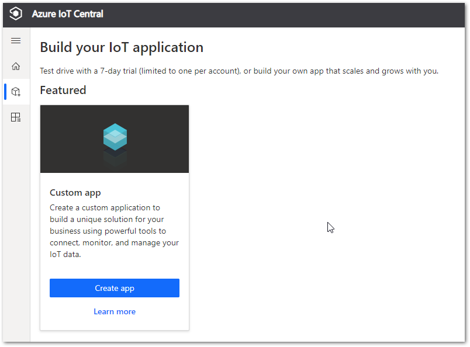
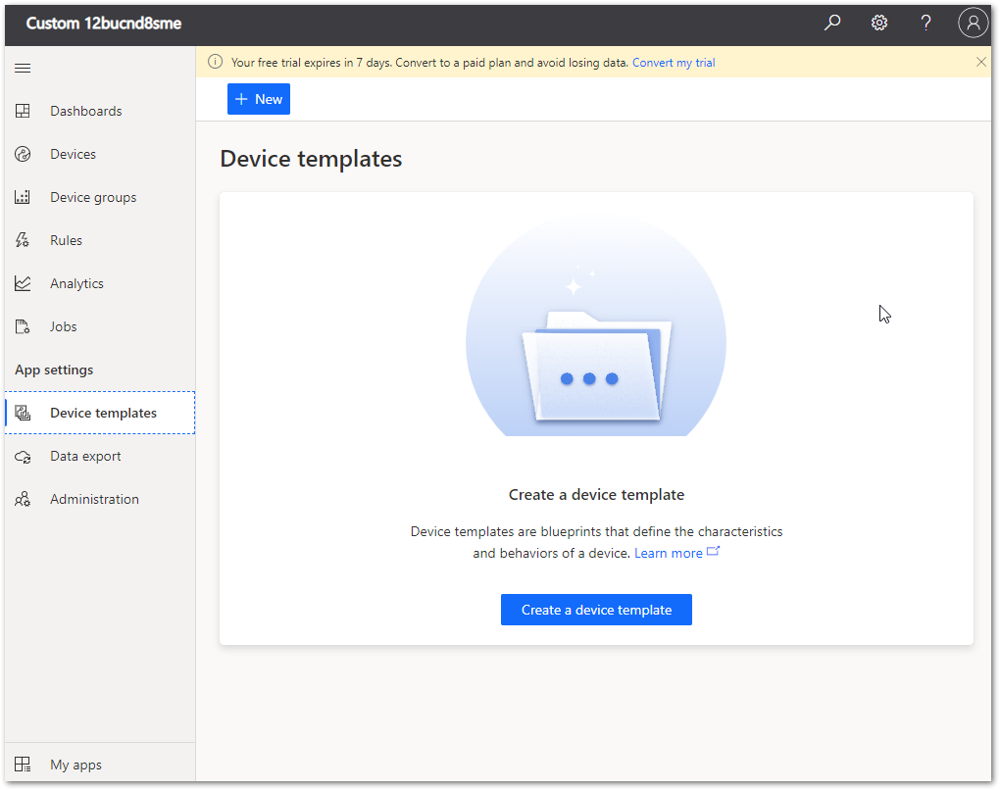
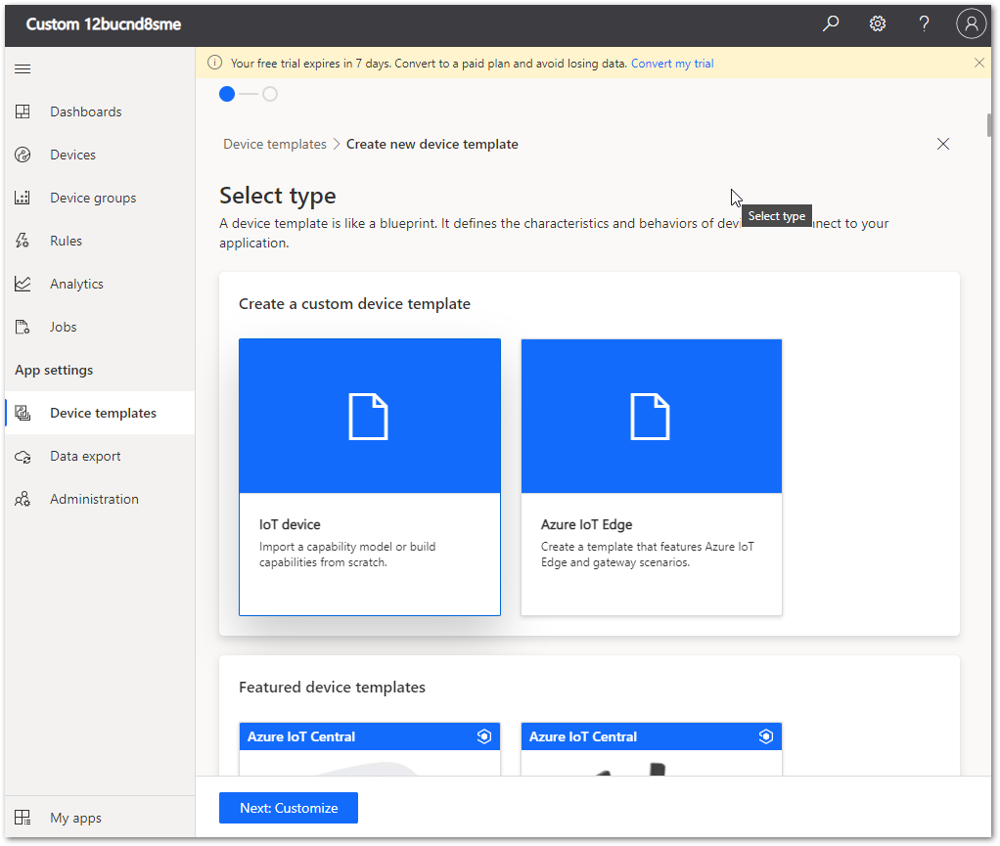
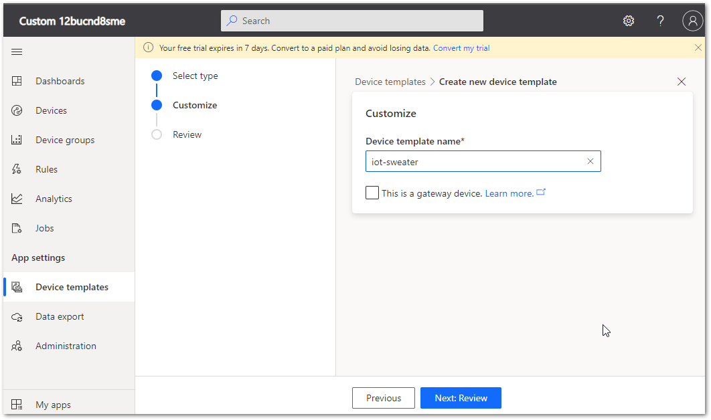
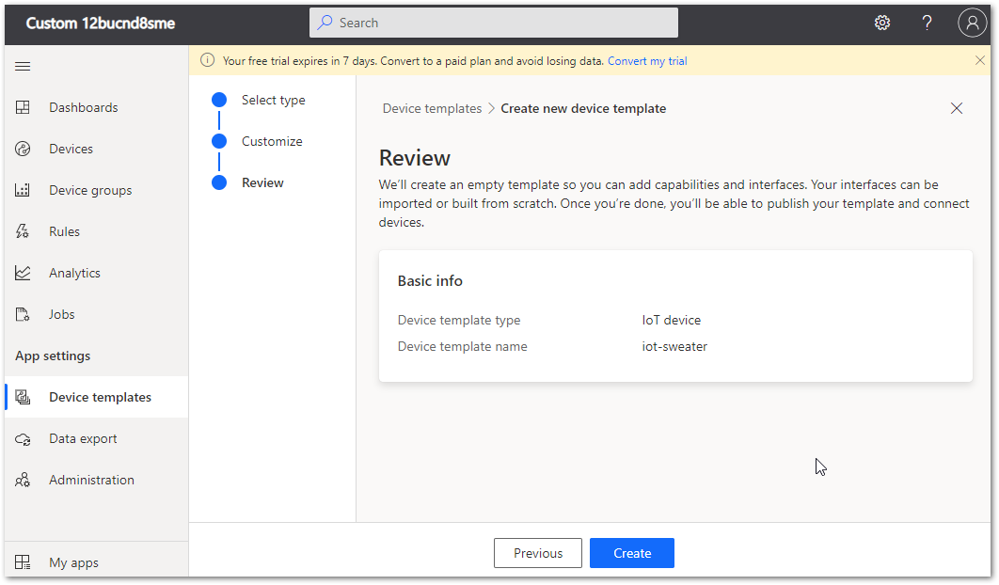
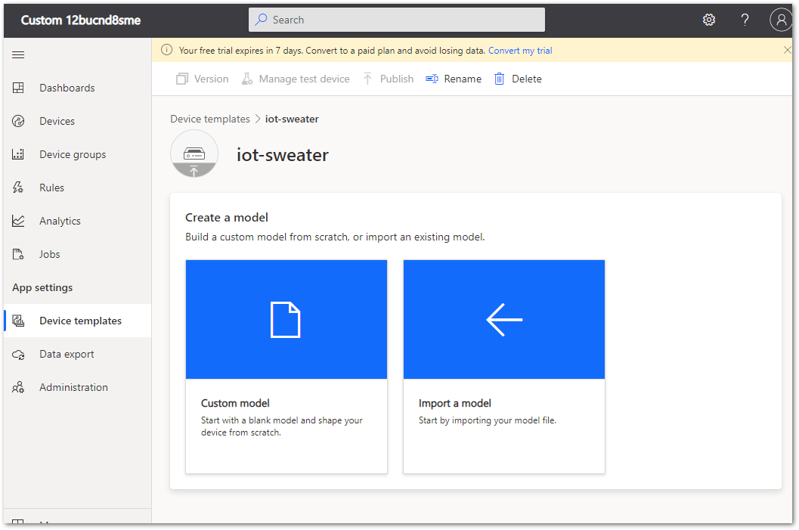
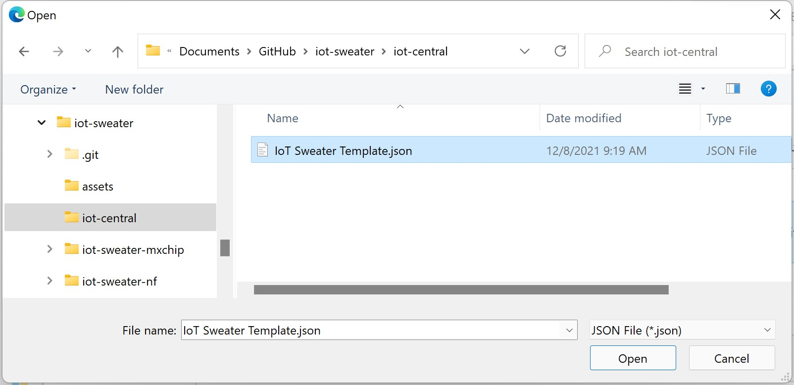
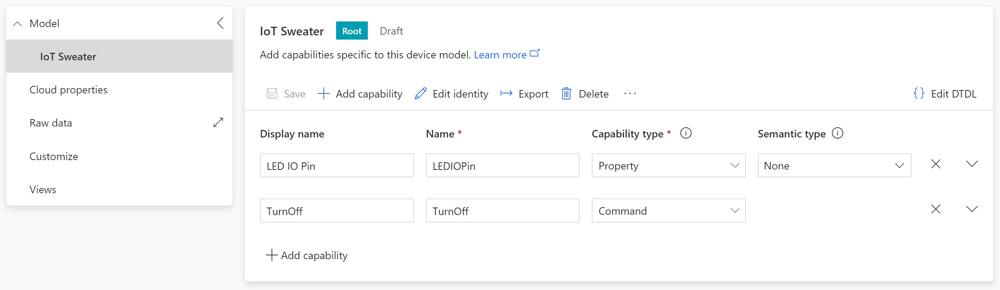
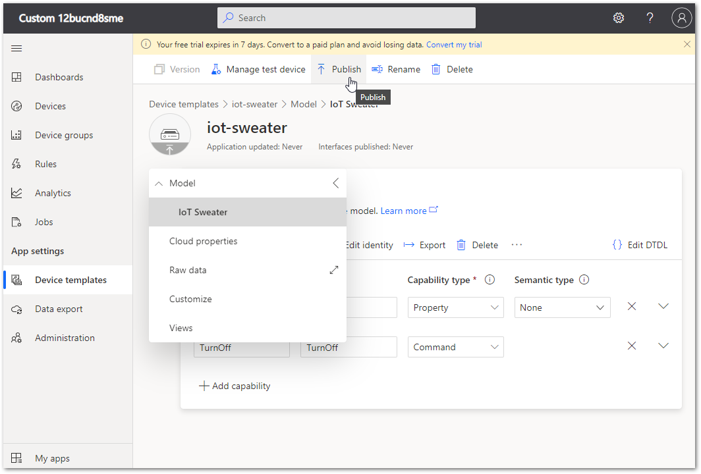

# Configure Azure IoT Central

## Instructions

### Step 1: Create and Configure Azure IoT Central

#### Task 1: Create your initial IoT Central app

1. Navigate to [Azure IoT Central](https://apps.azureiotcentral.com/?azure-portal=true).

    It's a good idea to bookmark this URL, as it's the home for all your IoT Central apps.

1. Take a minute to scroll down and read the contents of this home page.

1. On the left side navigation menu, click **Build**.

    Notice that there are several options that provide a more advanced starting point for certain scenarios.

1. Under **Featured**, click **Custom app**.
  

1. On the **New application** page, under **Application name**, enter your Application name. 

    You may use something like your family or company name followed by "Holiday Sweaters".

    Notice that the Application name that you enter is being used as the root for your application URL (converted to lower-case).

    Although your Application name can be any friendly name, the **URL** _must_ be unique. The two don't have to match exactly, but it can be less confusing when they do.

    Including your name in the Application name helps to ensure that the URL will be unique.

1. Under **Application template**, leave the default **Custom application** value.

1. Take a minute to review the fields under **Billing info**.

    The **Directory** field is used to specify an Azure Active Directory tenant. If your organization uses an AAD tenant, you would specify that here. For this workshop, you may leave the default.

    If you select a pricing option that includes a cost, you would need to specify an Azure subscription.

1. Under **Pricing plan**, click **Free**.

    Notice that the free option provides a 7-day trial and includes 5 free devices. The **Billing info** section has also been updated for **Contact info** instead.

1. Under **Contact info**, provide your contact information within each of the required fields.

    > **Note**: There is no commitment or termination fees associated with the plan. The **Build** page includes a link to [Get pricing details](https://aka.ms/iotcentral-pricing) if you are interested in reading more about IoT Central pricing.

1. At the bottom of the page, click **Create**.
  

    Wait a few seconds while the app resource is built, then you should see a **Dashboard** with a few default links.

1. Close the Azure IoT Central browser tab.

    The next time you open the Azure IoT Central home page, you will select **My apps** from the left side navigation menu, and your new app will be listed.

1. Use your browser to open [Azure IoT Central](https://apps.azureiotcentral.com/?azure-portal=true).

1. On the left side navigation menu, click **My apps**, and then click the application that you created above.

    Your next step is to specify a _device template_.

#### Task 2: Create the device template

The data that will be communicated between your device and IoT Central is specified in a _device template_. The device template encapsulates all the details of the data, so that both the device and IoT Central have all they need to make sense of the communication.

1. On the **Dashboard** page of your Azure IoT Central app, on the left side navigation menu under **App settings**, click **Device templates**.
  

1. Under **Device templates**, click **+ New**.

    You should see a range of custom and preconfigured device template options.

    > **TIP**: Take note of the preconfigured options. You may want to use one of these preconfigured device templates for a future project if you have the associated hardware.

1. Under **Create a custom device template**, click **IoT device**, then click **Next: Customize** at the bottom of the page.
  

1. Enter the **Device template name** "iot-sweater", then click **Next: Review** at the bottom of the page.
  

1. Verify that your **Device template type** and **Device template name** match the image below, then click **Create**.
  

1. To create the model for your new device template, select **Import a model** under **Create a model**.
  

1. Go to the location where your GitHub repo files were saved and browse to the **IoT Central** folder. Select **IoT Sweater Template.json** and click **Open**.
  

1. Verify that you see the model structure below...
   
 
    > **TIP**: You can add additional properties here to expand your project, if necessary.
    
1. At the top, select the **Publish** option to make this device template available for new devices. You will see a dialog with more detail on what is being published. Click **Publish** to complete the publishing process.
   

    Your next step is to add a _device_.

#### Task 3: Add a device
This is where you'll be adding your sweater device into IoT Central using the device template created above. Repeat this task for each of the different sweater devices you'll be adding.

1. Within your Azure IoT Central app, select **Devices** on the left side navigation menu.

1. Select **+ New** on the menu at the top to add your device.

1. Give your device a friendly name and enter a unique Device ID. _Example: ali-sweater_

1. Select the **iot_sweater** for the Device template, then click **Create**.
  

1. Click on your new device name to go into the device detail. At the top, select **Connect**. Save the ID scope, Device ID, and Primary key for future use. 

