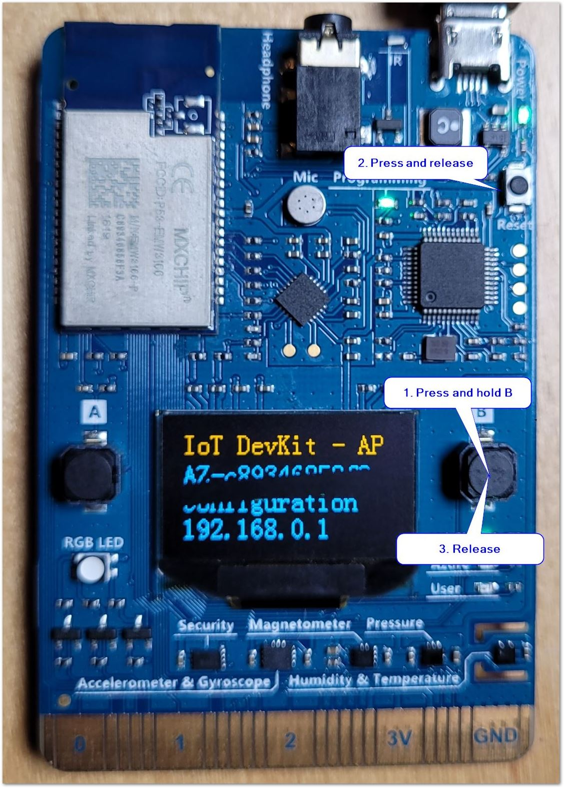
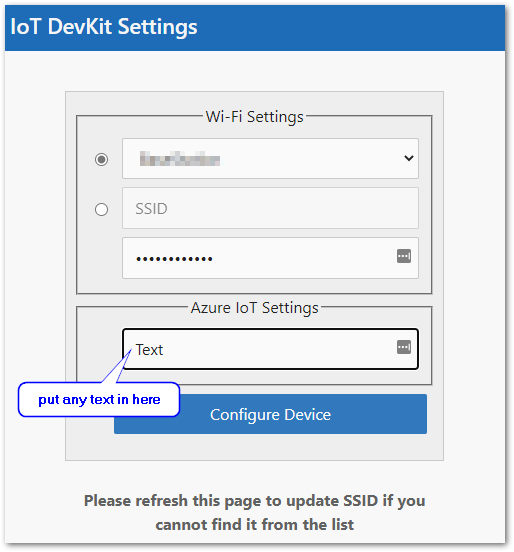
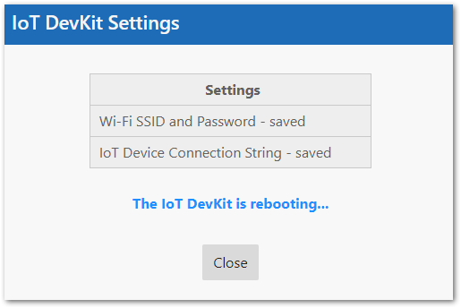
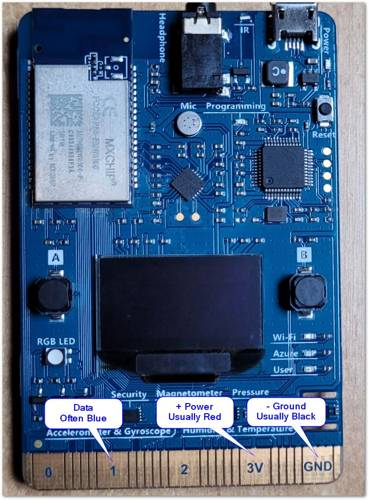
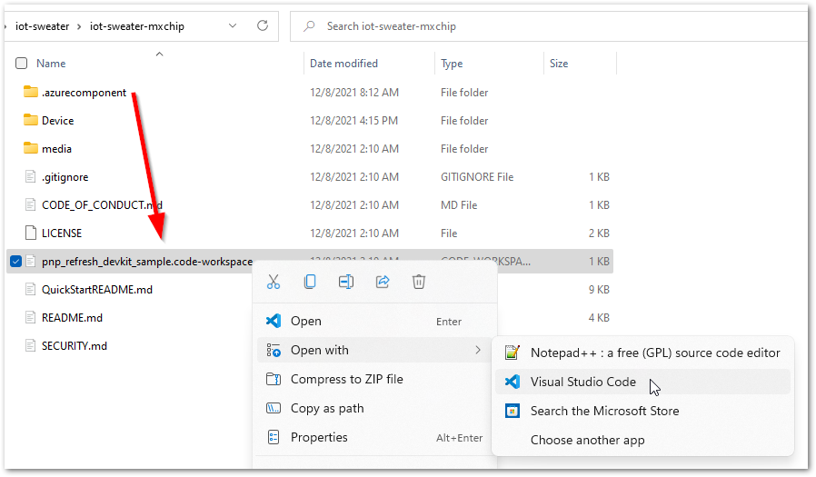
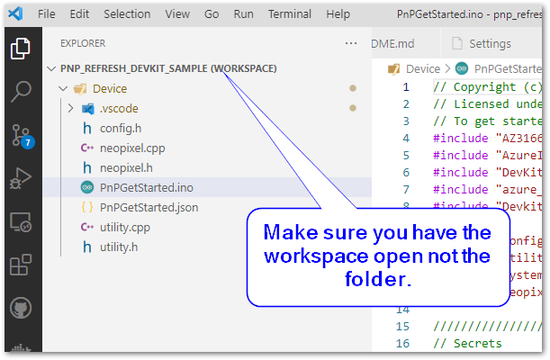
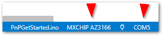
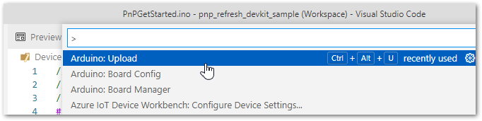

# Configuring MXChip IoT DevKit
[](/LICENSE)

This project is based on [Quickstart: Add IoT Plug and Play to your MXChip IoT DevKit](https://github.com/Azure-Samples/mxchip-iot-devkit-pnp-get-started) with slight modifications to enable connecting to Azure IoT Central using Device Provisioning Service (DPS).  All the trouble shooting and setup instructions in the [original readme document](QuickStartREADME.md) apply.


[AZ31166 IoT Developer Kit](https://www.seeedstudio.com/AZ3166-IOT-Developer-Kit.html) is an IoT development kit with plenty of built in sensors and IO ports which can also be flashed with and Arduino compatible firmware.

* [What you need for this project](#what-you-need-for-this-project)  
* [Configuring your development environment](#configuring-your-development-environment)  
* [Configure your device](#configure-your-device)
* [Connect the LEDs](#connect-the-leds)
* [Configure the software](#configure-the-software)

## What you need for this project
* Visual Studio Code
* MXChip development board, can be purchased at link above.
* Strand of NeoPixel or any other brand controlled by a WS2812 chip
* USB power supply or battery pack and USB cable
* Some wires to connect LEDs to the dev board

## Configuring your development environment
1. If you don't have Visual Studio Code installed you can download and install it from: [https://code.visualstudio.com/download](https://code.visualstudio.com/download)

1. We are going to be using an arduino compatible firmware on the device, so we need to configure that environment
    * First install the latest version of Arduino IDE from here: [https://www.arduino.cc/en/software#download](https://www.arduino.cc/en/software#download)  
        Make sure you are not using the version from the store
    * Now instal [Visual Studio Code extension for Arduino](https://marketplace.visualstudio.com/items?itemName=vsciot-vscode.vscode-arduino)

    ## Note configuring settings step for Arduino plugin and installation of the serial port driver is missing look at [these instructions](https://docs.microsoft.com/en-us/samples/azure-samples/mxchip-iot-devkit-get-started/sample/) for completing your setup.  If you follow these instructions make sure to install version 2.0 of the SDK in Arduino board manager.


## Configure your device
1. Update the firmware
  * First we need to download and install the latest [GetStarted fimware](https://aka.ms/devkit/prod/getstarted/latest) after clicking on this link save the file to your hard drive.
  * Now plug in your MXChip board and wait a few seconds
  * You should be able to see a new drive mounted with volume name "AZ3166" open that volume, there should be a file called DETAILS.TXT it has the version information for the current firmware (good to know to make sure you are using the right volume)
  * Copy the file you downloaded to the new volume.
  * Your device will automatically update and reboot at this time.  
1. Connect to WiFi
  * To connect to WiFi we need to put the board in configuration mode, to do this, press and hold the **B** button, then press and release the **Reset** button once the board is in configuration mode release the **B** button
  
  * At this point you should see the words "IoT DevKit - AP" followed by AZ-*\<your device serial number>* which is the temporary access point SSID, and the ip address of the web server.
  * On your phone or computer connect to the temporary access point (there is no password)
  * On a web browser navigate to [http://192.168.0.1](http://192.168.0.1)
  * On this page select your access point from the drop down and enter your password.
  * You'll see a place for "IoT Device Connection String" we don't use this, but there needs to be some text in there for the settings to save.  
    
  * Once you press Configure Device button, your device will reboot and should be able to connect to your access point.  
  

## Place holder for instructions to create the device in IoT Central

## Connect the LEDs
For this project we are going to use a strand of individually addressable LEDs 
controlled by [WS2812B](https://www.digikey.com/en/datasheets/parallaxinc/parallax-inc-28085-ws2812b-rgb-led-datasheet) controllers. 
You can easily purchase these on-line in many form factors or from [Adafruit where they are known as known as NeoPixel](https://learn.adafruit.com/adafruit-neopixel-uberguide).  
I've been able to connect up to 30 of these directly to the MXChip's power pins without needing an external power supply.

* Connect the power wires to the 3V and GND pads on the board and the data wire to the 1 pad on the board. 



## Configure the software
1. Open the project in Visual Studio Code
  * Start Visual Studio Code by navigating to iot-sweater/iot-sweater-mxchip folder and opening the "pnp_refresh_devkit_sample.code-workspace" file.  You can also open visual studio code first and open the workspace from there.  
  
  * **Make sure you have opened the work space not the folder**
  

1. Update the project with your secrets
  * Open the PnPGetstarted.ino file and find the following lines and update them with  information from above.
  ```C
//////////////////////////////////////////////////////////////////////////
// Secrets

// Fill these in from your device values in Azure IOT Central
static const char *deviceId = "<replace with your device Id>";
static char *sasPrimaryKey = "<replace with your Device SAS Primary Key>";
static const char *idScope = "<replace with your Id Scope>";
//////////////////////////////////////////////////////////////////////////
```

1. Download the application to your device
  * Make sure the correct board and serial ports are selected.  Look at the bottom of the VSCode screen and make sure "MXHCIP AZ3166" and the correct serial port selected, note that your serial port might be different.  
  
  *  Press Ctrl-Shift-P (or F1) to open the command pallet and search for Arduino:Upload command.  
  
  * Press enter, and if everything goes well you device should reboot and connect to IoT Central
