# Configuring ESP32 and .NET nanoFramework
[](/LICENSE)

[.NET nanoFramework](https://www.nanoframework.net/) is an open source platform that enables you to write managed 
C# code for embeded devices. For more details you can refer to the documentations at: [https://docs.nanoframework.net/]()  
For more information you can read the introduction to [.Net nanoFramework](https://docs.nanoframework.net/content/introduction/what-is-nanoframework.html)  

[ESP32](https://www.espressif.com/en/products/socs/esp32) is a fairly inexpensive and easy to use micro controller 
with integrated WiFi and blue-tooth support that can be readily purchased on ebay or online book sellers.

* [What you need for this project](#what-you-need-for-this-project)  
* [Configuring your development environment](#configuring-your-development-environment)  
* [Configure your device](#configure-your-device)
* [Connect the LEDs](#connect-the-leds)
* [Configure the software](#configure-the-software)

## What you need for this project
* Visual Studio for windows
* An ESP32 development board
* Strand of NeoPixel or any other brand controlled by a WS2812 chip
* USB power supply or battery pack and USB cable
* Some wires to connect LEDs to the dev board


## Configuring your development environment
1. For this project you need a copy of Visual Studio for Windows versions 2017, 2019, and 2022 are supported. 
If you don't have Visual Studio installed you can download a free copy of the community eddition at [https://visualstudio.microsoft.com/downloads/]()

1. Install the nanoFramework extension for Visual Studio
   * Click on Manage Extensions in the Extensions menu  
   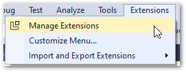  

   * Search for nanoFramework extension and install it you will have to restart Visual Studio to finish the installation  
     

1. After install is complete open the Device Explorer by going to menu item: View > Other Windows > Device Explorer
   if your device is connected to your computer you should see something like this: (note that your device might not show up here until the next step)  
   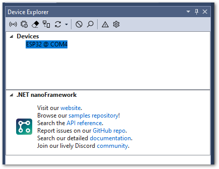  

    There is also more details and troubleshooting guides at the [getting started guilde](https://docs.nanoframework.net/content/getting-started-guides/getting-started-managed.html)  
  

## Configure your device
Before you can start deploying your code to the ESP32 you need to flash it with the firmware that has the nanoFramework runtime we are using.

1. Make sure you have the latest .NET SDK installed by typing `dotnet --info` at command prompt. You can install the SKD from [https://dotnet.microsoft.com/download]  

1. After the SDK is installed install the nanoFirmwareFlasher by typing `dotnet tool install -g nanoff` at command prompt. Veryfy the install by typing `nanoff` at command prompt  

1. Connect your device to your computer using a USB cable  

1. Start *Device Manager* (type device manger in Windows search) and open the Ports section and note the COM port your device is connected to.  
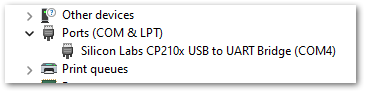  

1. Install the nanoFramework firmware on your ESP32 make sure to change the COM port to the correct number for your setup from the previous step.  
If this specific version is not available anymore, install the latest, but you need to make sure to update the project nuget packages to a 
version that matches the mscorlib that is included with your image  
`nanoff --update --target ESP32_REV0 --baud 115200 --fwversion 1.7.2.6 --serialport COM4`  
For more information and troubleshooting look at [this section of getting started guide](https://docs.nanoframework.net/content/getting-started-guides/getting-started-managed.html#uploading-the-firmware-to-the-board-using-nanofirmwareflasher)  


1. Connect your device to WiFi. The firmware can store your WiFi credentials with out you having to put it in your code, to do this
   * Open device explorer  
     

   * Click the Edit Network Configuration tool icon  
   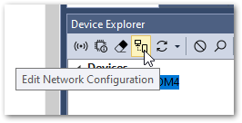  

   * Selecte the WiFi-Profiles tab and enter your SSID and Password once you press OK it should connect to your network  
  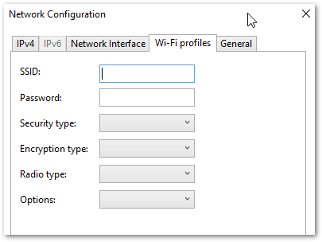

1. Upload Azure certificate, since we are going to use TLS to communicate with Azure IoT Central, we need a copy of it's certificate.
There is a copy of this in the `iot-sweater\iot-sweater-nf\config` directory of this repository.  
*Note that you might need to use a differenct certificate if you are doing this past june 2022 [see this blog for more information](https://techcommunity.microsoft.com/t5/internet-of-things-blog/azure-iot-tls-critical-changes-are-almost-here-and-why-you/ba-p/2393169)*

   * Open device explorer  
     

  * Click the Edit Network Configuration tool icon  
     

  * Navigate to the General tab and click the Browse button for **Root CA** certificate and select `BaltimoreRootCA.crt.der`  
  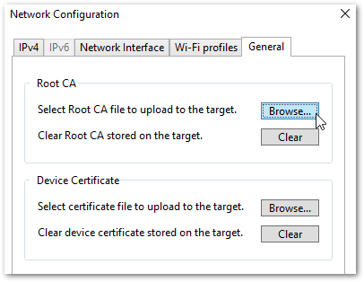  

  * Press OK to upload it to the ESP32 device.

At this point your device should be all ready to connect to Azure IoT Central

## Connect the LEDs
For this project we are going to use a strand of individually addressable LEDs 
controlled by [WS2812B](https://www.digikey.com/en/datasheets/parallaxinc/parallax-inc-28085-ws2812b-rgb-led-datasheet) controllers. 
You can easily purchase these on-line in many form factors or from [Adafruit where they are known as known as NeoPixel](https://learn.adafruit.com/adafruit-neopixel-uberguide).  
I've been able to connect up to 30 of these directly to the ESP32's power pins without needing an external power supply.

1. On your develpment board locate the +5, ground and the GPIO pin you are going to be using (I used 33)  
    **Keep in mind that your board might look different**  
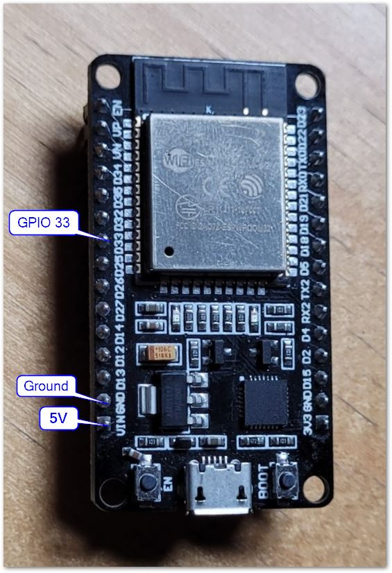  

2. Connect a set of jumper wires to your NeoPixels making note of the colors.  
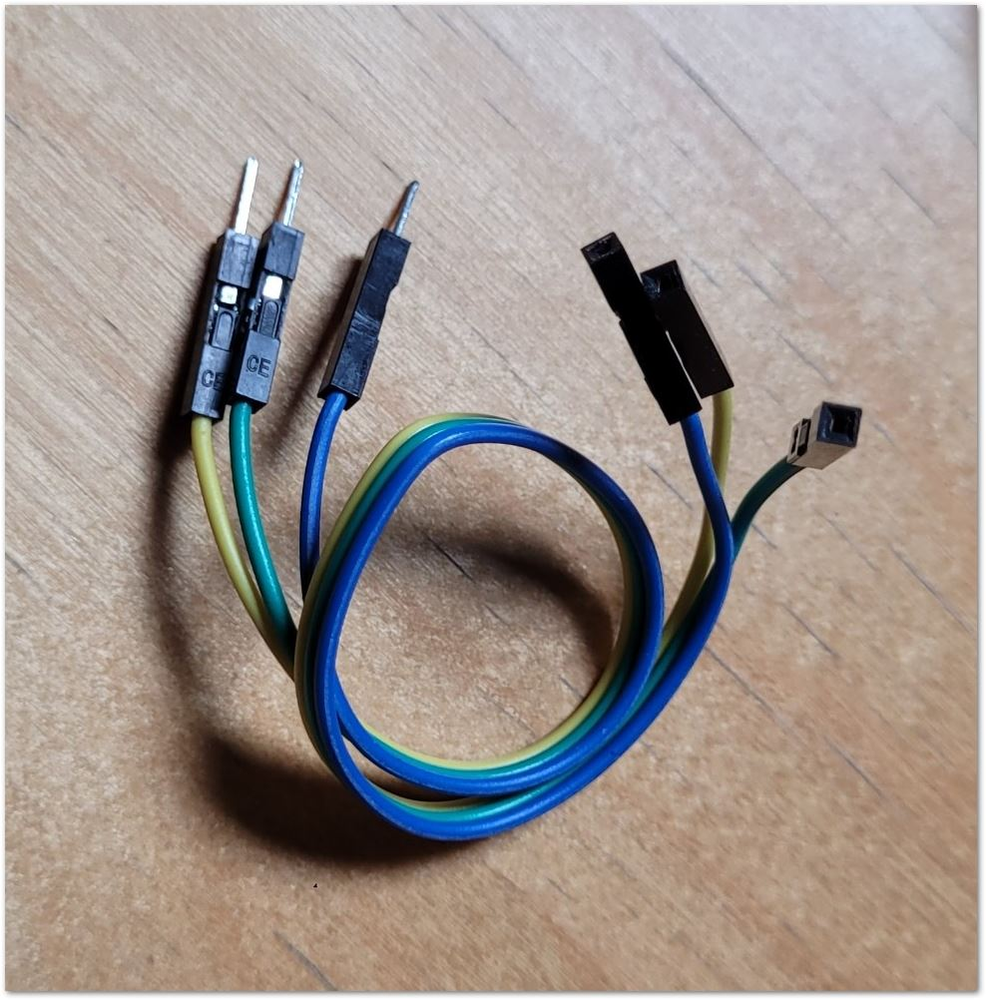  
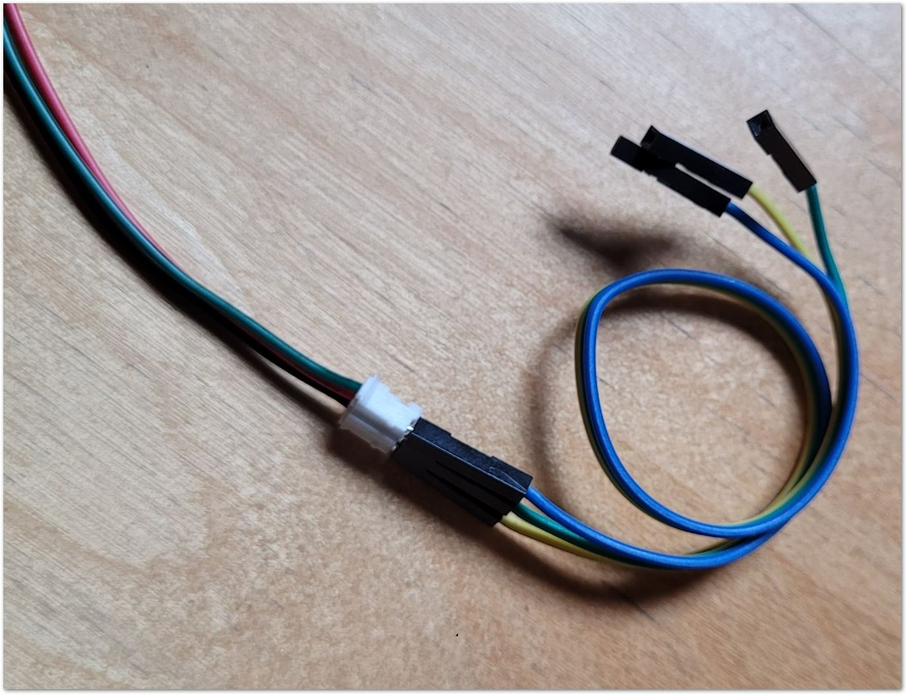  

3. Now connect the jumper wires to your ESP32 take care to make sure the NeoPixel wires are connected to the right pins 
specially if you are using different color jumper wires.  
Red -> +5  
Black -> Ground  
Green -> GPIO port  
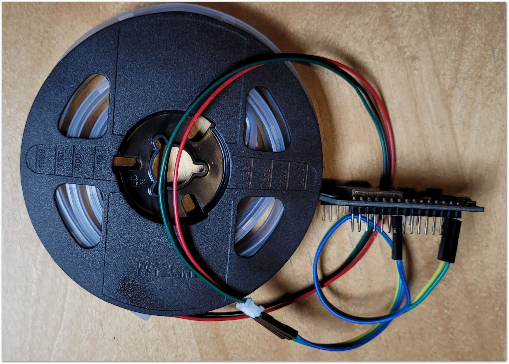

Now your board is ready to go.


## Configure the software
Now we need to configure a few parameters in the code.  If you haven't created your IoT Central instance, now is the time
to do so, you can follow the instructions [in this file](../iot-central/README.md).

1. Open `iot-sweater-nf.sln` file with visual studio  
1. In the iot-sweater project open the `Configuration.cs` file 
you should see the following code:
    ```csharp
        public partial class Configuration
        {
            public const int LEDGpioPin = 33;
            public const uint LEDCount = 30;

            public const string DeviceID = "ali-sweater";   //Replace with your own device ID
            public const string DeviceModelId = "dtmi:com:contoso:iotSweater:devthehalls;1";    //Edit this if you are providing your own template
                                             

            public const bool CheckMemoryUsage = true; //keep an eye on memory usage, causes GC to run often
            public const int NetworkConnectTimeout = 60000;
            public const int WifiConnectRetries = 10;

            public const int DpsRegistrationTimout = 30000;
            public const string DpsAddress = "global.azure-devices-provisioning.net";
        }
    ```
      * Edit **LEDGpioPin** if you used a different pin for your GPIO
      * Change the **LEDCount** to the number of LEDs you are controlling
      * Give your device a unique name by changing **DeviceID**
      * If you are providing your own template then change the **DeviceModelID**  

1. Now create a new file called `Secrets.cs` and paste the following code in there.  
   **Note that this file contains sercrets about your account and should not be checked in**
    ```csharp
    namespace iot_sweater
    {
        public partial class Configuration
        {
            public const string Devicekey = "";
            public const string IdScope = "";
        }
    }
    ```
    * Go to your IoT Central Administration tab and open the Device connection tab  
    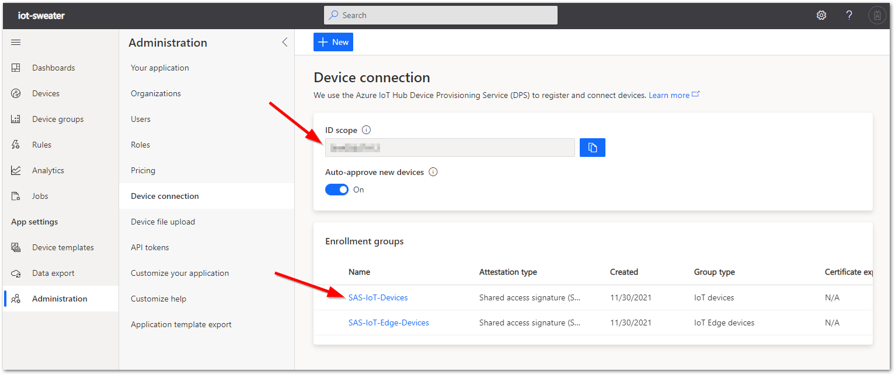  
    * Copy the ID scope value you see there between the quotes for IdScope variable  
    * Next click on the *SAS-IoT-Devices* link to open the enrollment group  
    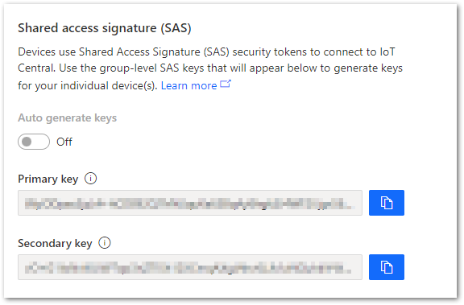  
    * We are going to use the primary key to create a device specific key (it's not a good idea to include your SAS keys in your code)  
    * Open a command prompt and type the following commands, make sure to replace the placeholder text 
    with your own device ID and access key
    ```
    az extension add --name azure-iot
    az iot central device compute-device-key --device-id <your devide ID from above> --pk <the group primary key value>    
    ```  
    * Copy the device specific key into the Secrets.cs file for Devicekey value.

1. AT this point everything should be ready, make sure your device is connected to your computer, and it shows up in Device Explorer 
press F5 or click the start debugging button 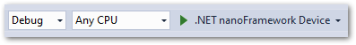 the application 
should get dployed to the device and start running.  
If everything goes correctly, after a few minutes you should be able to see your device in IoT Central  
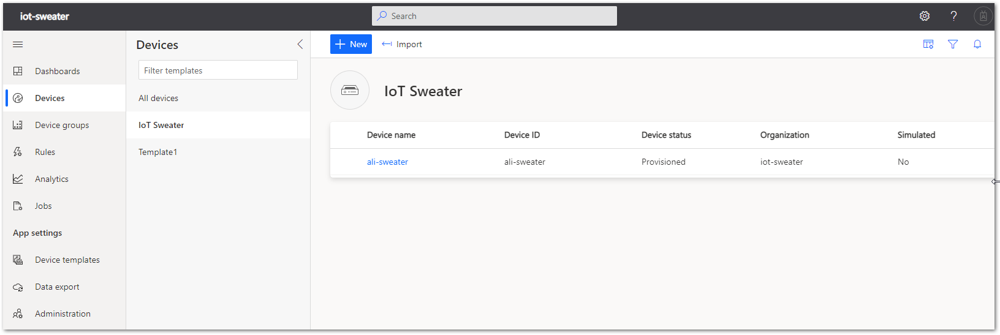
    
